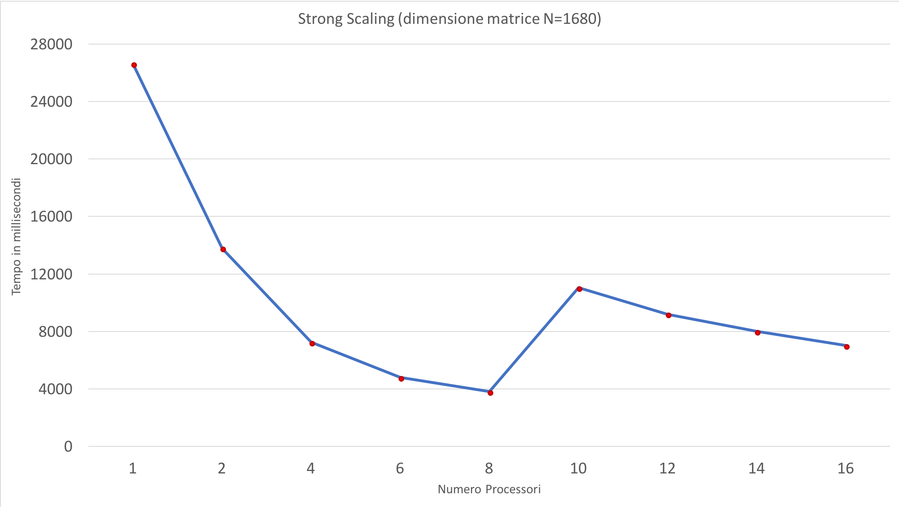
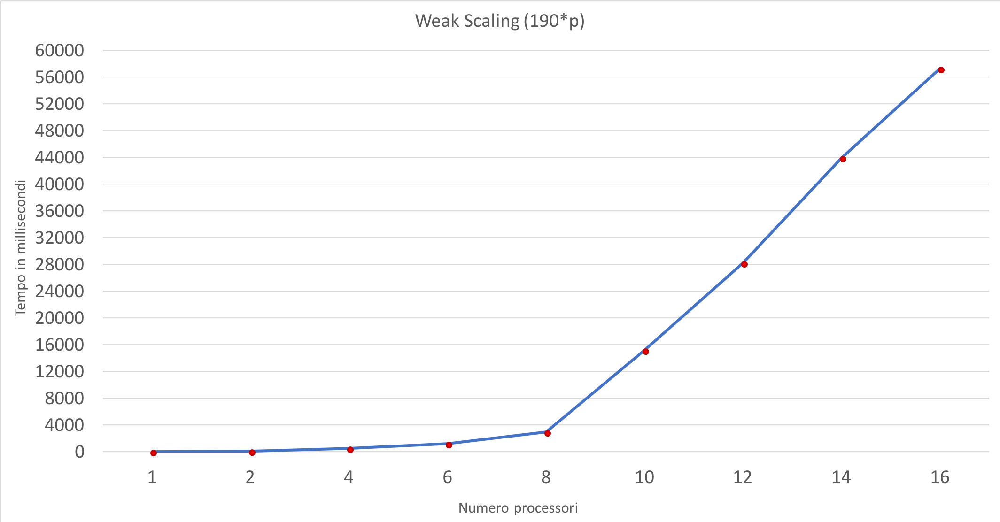

# Parallel Matrix Multiplication

### Programmazione Concorrente, Parallela e su Cloud

##### Università degli Studi di Salerno									Anno accademico *2017/2018*

**Prof. Vittorio Scarano**

**Dott. Carmine Spagnuolo**

**Studente: Angelo Settembre**

------

### Problem statement

------

In questo progetto si vuole risolvere il problema del calcolo della moltiplicazione tra matrici. Date due matrici A e B di dimensione *(n x n)*, viene effettuato il prodotto righe per colonne tra le due matrici. Il risultato verrà riportato nella matrice risultato C.


------

### Soluzione proposta

L'obiettivo era quello di parallelizzare la moltiplicazione tra matrici utilizzando MPI. La soluzione proposta considera solo matrici quadrate **N x N** dove la dimensione di ogni matrice deve essere divisibile per il numero di processori **p**. Nel caso in cui la dimensione in input non è divisible per il numero di processori **p**, il programma si arresta. Il programma prende in input la taglia delle matrici, costruendo le matrici A e B in maniera randomica (range di valori tra 0 e 9). In outuput fornirà la matrice risultato C. La comunicazione per i processori è stata realizzata mediante l'utilizzo di operazioni collettive come **MPI_Bcast**, **MPI_Scatter**, **MPI_Gather**. Vista la natura del problema, la soluzione che è stata attuata prevede il partizionamento della matrice A in righe, tutte composte dallo stesso numero di colonne, distribuite tra i vari processori. 


Ogni processore, quindi, avrà (**numero di righe / numero di processori**) righe. Poiché la dimensione della matrici è divisibile per il numero di processori (**SIZE / p**), ogni processore avrà un numero di righe equo. La matrice B, invece, verrà ricevuta da tutti i processori, in questo modo ogni processore può effettuare il prodotto tra la porzione della matrice A e le colonne della matrice B.

## Implementazione
### Inizializzazione MPI e controllo divisibilità
Nella fase iniziale, viene inizializzato l'ambiente MPI.

```c
/* start up MPI */
MPI_Init(&argc, &argv);

/* find out process rank */
MPI_Comm_rank(MPI_COMM_WORLD, &my_rank);

/* find out number of processes */
MPI_Comm_size(MPI_COMM_WORLD, &p);
```
Successivamente, come già accennato nel paragrafo precedente, il programma prende in input da linea di comando, la dimesione della matrici quadrate.

```c
int SIZE = atoi(argv[1]);					
```
Una volta acquisita la dimensione si controlla se tale dimensione è divisibile per il numero di processori. Se non è divisibile, il processore MASTER fa terminare la computazione.

```c
if(p % SIZE != 0){
	if(my_rank == 0){
		printf("Matrix is not divisible by number of processors \n\n");
		printf("----BYE----");
	}
	MPI_Finalize();
	return 0;
}
```

### Allocazione e costruzione matrici
In questa fase, vengono allocate dinamicamente le matrici nel heap: ogni matrice verrà allocata come un array di puntatori con blocchi contigui di memoria.


```c
/*ALLOCAZIONE MATRICI (PUNTATORI DI PUNTATORI) NEL HEAP*/
matrixA = (int **) malloc(SIZE*sizeof(int*));				//ALLOCAZIONE PER RIGHE
allocateMatrix(matrixA, SIZE);

matrixB = (int **) malloc(SIZE*sizeof(int*));				//ALLOCAZIONE PER RIGHE
allocateMatrix(matrixB, SIZE);

matrixC = (int **) malloc(SIZE*sizeof(int*));				//ALLOCAZIONE PER RIGHE
allocateMatrix(matrixC, SIZE);
/*--------*/
...
...
...
void allocateMatrix(int **matrix, int size){
	int i;
	int *contiguousItems = (int *)malloc(size*size*sizeof(int));	//ALLOCAZIONE DI SIZE*SIZE ELEMENTI CONTIGUI

	for(i=0;i<size;i++)
		matrix[i]= &contiguousItems[i*size];			//SI RENDE LA MATRICE COME UN ARRAY
}
```
Dopo la allocazione, il processore MASTER ha il compito di inizializzare le matrici A e B con valori randomici (tra 0 e 9):

```c
if (my_rank == 0){							
		printf("Matrix Multiplication MPI From process 0, Num processes: %d, Matrix size: %d\n", p, SIZE);
		/*COSTRUZIONE MATRICI*/
		createMatrix(matrixA, SIZE);
		createMatrix(matrixB, SIZE);

		printf("Matrix A \n");
		printMatrix(matrixA, SIZE);				 //Stampa Matrice A
		printf("\n");

		printf("Matrix B \n");
		printMatrix(matrixB, SIZE);			     //Stampa Matrice B
		printf("\n");
}
...
...
...
void createMatrix(int **matrix, int size){
	int i,j;
	for(i = 0; i<size; i++){
		for(j=0; j<size; j++){
			matrix[i][j] = rand() % 10;		   //Valori tra 0 e 10 escluso
		}
	}
}
```
### Calcolo indici matrice
Una volta allocate e costruite le matrici A e B, vengono calcolati gli indici di inizio e di fine di ogni porzione di matrice assegnata ad un processore.

```c
fromProcess = my_rank * SIZE/p;
toProcess = (my_rank+1) * SIZE/p;
```
### Invio matrice B in broadcast
Nel caso in cui vi siano più processori **(p != 1)**, il processore MASTER invia in broadcast la matrice B a tutti i processori. In questo modo ogni processore (compreso il MASTER) ha la matrice B con cui dopo può effettuare la moltiplicazione. Viene utilizzata la routine di comunicazione collettiva **MPI_Bcast** inviando l'intera matrice B.


```c
MPI_Bcast(&matrixB[0][0], SIZE*SIZE, MPI_INT, 0, MPI_COMM_WORLD);
```

### Costruzione e allocazione data type
Si definisce un tipo derivato per le matrici. Si utilizza la routine **MPI_Data_Type**.

```c
MPI_Datatype matrixType;
...
...
MPI_Type_contiguous(SIZE*SIZE/p, MPI_INT, &matrixType);
MPI_Type_commit(&matrixType);
```

Una volta costruito il data type, viene allocato utilizzando la routine **MPI_Type_contiguous** dove viene replicato il data type *matrixType* in **SIZE * SIZE / p** posizioni contigue.


La scelta è ricaduta sulla dimensione **SIZE * SIZE / p** poiché ciascun processore deve avere la propria porzione di sottomatrice, in maniera tale che ognuno di essi può effettuare la moltiplicazione equamente.

### Invio righe matrice A
Dopo che la matrice B risulta essere inviata, il processore MASTER distribuisce equamente le porzioni di matrice A a tutti i processori che fanno parte della computazione. Viene utilizzata la routine **MPI_Scatter** dove la matrice A viene inviata per righe (come un array) e tali righe vengono inviate nella porzione di matrice A che ogni processore possiede. Viene utilizzato il data type *matrixType*.


```c
MPI_Scatter(*matrixA, 1, matrixType, matrixA[fromProcess], 1, matrixType, 0, MPI_COMM_WORLD);
```

### Calcolo moltiplicazione tra matrici
Per il calcolo della moltiplicazione tra matrici, è stato utilizzato un algoritmo abbastanza semplice in quanto viene effettuato prima il prodotto tra le righe della matrice A e le colonne della matrice B e poi il risultato, verrà sommato con il risultato precedente e così via. Questo tipo di algoritmo richede *n^3* moltiplicazioni e *n^3* addizioni, che portano ad una complessità temporale di O(n^3).
Nel codice si può notare che all'interno del primo **for**, l'indice delle matrici viene gestito in maniera tale che l'indice di inizio (**fromProcess**) e l'indice di fine (**toProcess**), andranno a stabilire la porzione di matrice su cui ogni processore dovrà operare. Esempio (N=30, e p=3):

* il processore 0 avrà la porzione di matrice tra 0 e 10
* il processore 1 avrà la porzione di matrice tra 10 e 20
* il processore 2 avrà la porzione di matrice tra 20 e 30


```c
for(i=fromProcess; i<toProcess; i++){
	for(j=0; j<SIZE; j++){
		for(k=0; k<SIZE; k++){
			sum = sum + matrixA[i][k]*matrixB[k][j];
		}
		matrixC[i][j] = sum;
		sum = 0;
	}
}
```
### Invio risultato moltiplicazione matrici al processore MASTER
Una volta che un processore ha effettuato la moltiplicazione con la propria porzione di matrice, il risultato sarà memorizzato all'interno matrice C locale al processore. Quindi ogni processore dovrà inviare la propria porzione di matrice C al processore MASTER il quale le righe che riceverà saranno ridistribuite in base al rank, all'interno della matrice finale C. Viene utilizzata la routine di comunicazione collettiva **MPI_Gather**.

```c
MPI_Gather(&matrixC[fromProcess][0], 1, matrixType, &matrixC[0][0], 1, matrixType, 0, MPI_COMM_WORLD);
```


### Stampa matrice risultato
Una volta che il processore MASTER ha ricevuto tutte le porzioni della matrice C, egli stamperà la matrice risultato C.

```c
if (my_rank == 0) {
	printf("\nThe multiplication between the two matrix is:\n");
	printMatrix(matrixC, SIZE);
	printf("\n\n");
}
...
...
...
void printMatrix(int **matrix, int size){
	int i,j;
	for(i = 0; i<size; i++){
		printf("\n\t[");
		for(j=0; j<size; j++){
			printf(" %d ",matrix[i][j]);
		}
		printf("]");
	}
	printf("\n");
}
```
### Deallocazione puntatori e fine computazione
Dopo che il processore MASTER ha stampato la matrice risultato C, ogni processore dealloca il datatype e i tre puntatori.

```c
/* shut down MPI */
if(p != 1){
	MPI_Type_free(&matrixType);
}

/*DEALLOCAZIONE PUNTATORI*/
free(matrixA);
free(matrixB);
free(matrixC);
/*-------*/

MPI_Finalize();
```
------

## Testing
### Benchmarking
I benchmark sono stati condotti utilizzando delle instanze di tipo **m4.large** (2 core) di Amazon Web Services. I test sono stati effettuati 3 volte dopodiché è stata presa in considerazione la media dei valori risultanti. Il tempo di esecuzione è stato considerato a partire dal momento successivo alla allocazione e della inizializzazione delle matrici da parte del processore MASTER. I tempi sono stati misurati in millisecondi ed è stata utilizzata la routine **MPI_Wtime**.

```c
startTime = MPI_Wtime();
//Codice operazioni collettive e calcolo moltiplicazione
endTime = MPI_Wtime();					
if (my_rank == 0) {
	printf("\nThe multiplication between the two matrix is:\n");
	printMatrix(matrixC, SIZE);
	printf("\n\n");
	printf( "Elapsed time is %f ms\n", (endTime - startTime)*1000);
}		
```
Risorse massime utilizzate:

* 8 Istanze EC2 m4.large **StarCluster-Ubuntu_12.04-x86_64-hvm** - ami-52a0c53b
* 16 processori

### Strong Scaling
Nei test di strong scaling, in input è stata utilizzata una matrice di dimensioni 1680x1680, al fine di garantire che la dimensione della matrice sia divisibile per il numero di processori (2,4,6,8,10,12,14,16). Di seguito vengono riportati, in sottoforma tabellare, i tempi di esecuzione dei test:

**N.processori**|**Tempo (ms)**
:-----:|:-----:
1|26613,09|
2|13778,02|
4|7237,80|
6|4801,97|
8|3819,69|
10|11034,81|
12|9193,20|
14|8003,22|
16|7014,88|

Di seguito il grafico corrispondente:



Dal grafico si può notare che vi è un aumento di tempo dall'utilizzo di 10 processori in poi dovuto probabilmente dall'alto overhead di comunicazione.

### Weak Scaling
Per la weak scaling, la dimensione della matrice deve crescere proporzionalmente al numero di processori. Si è scelto quindi di definire la dimensione della matrice in funzione di p, cioè: **n=130*****p** dove **p** è il numero di processori utilizzati. Di seguito vengono riportati, sottoforma tabellare, i tempi di esecuzione dei test:

**N.processori**|**Tempo (ms)**
:-----:|:-----:
1|7,89|
2|39,59|
4|170,76|
6|498,79|
8|782,81|
10|3964,83|
12|7239,65|
14|11962,77|
16|15002,68|

Di seguito il grafico corrispondente:



### Compilazione
Il sorgente va compilato con l'istruzione seguente:

```
mpicc Matrix_Multiplication_MPI.c -o MatrixMultiplicationMpi
```

### Esecuzione
Per eseguire il programma, bisogna passare il numero di processori, le macchine cluster e la dimensione della matrice:

```
mpirun -np NUMERO_DI_PROCESSORI -host INDIRIZZI_IP_MACCHINE_CLUSTER MatrixMultiplicationMpi DIMENSIONE_MATRICE
```